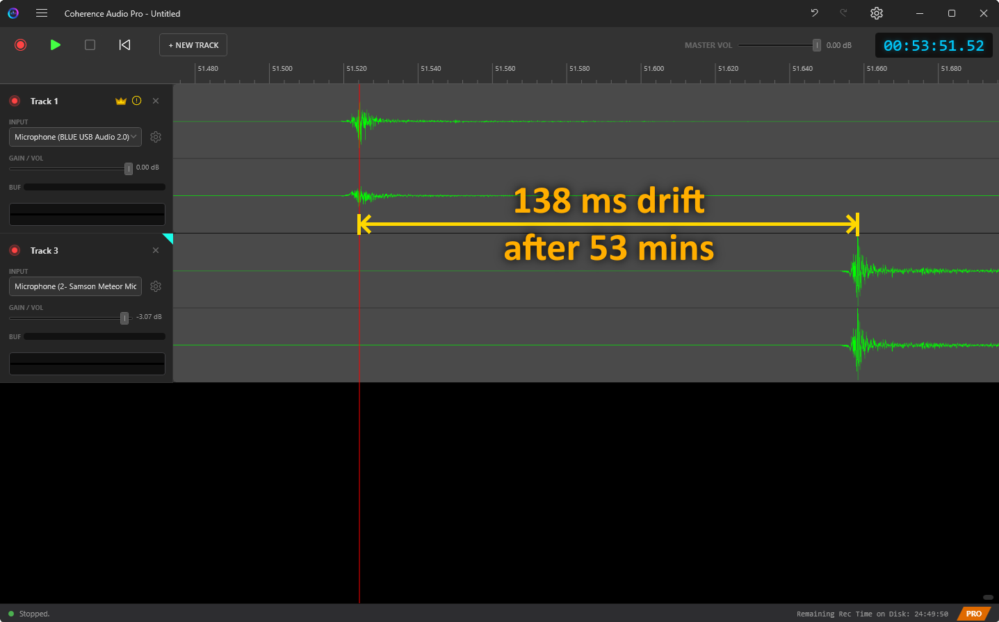
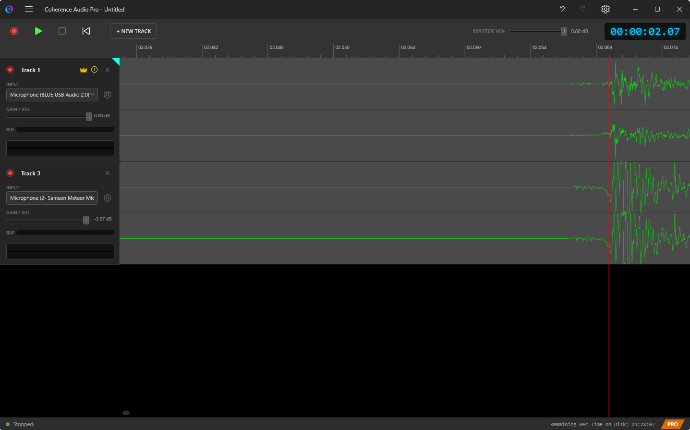
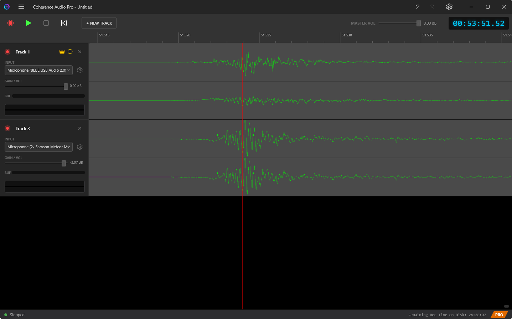

# Clock Sync and Drift Correction

This chapter explains what USB clock drift is, why it matters for multi-microphone recording, and how Coherence Audio Pro measures and corrects it.

---

## What Is Clock Drift?

Every USB audio device contains a small crystal oscillator that controls the rate at which it samples audio. The device's firmware generates exactly (for example) 48,000 samples per second by dividing its crystal frequency down to the target sample rate.

In theory, every device running at 48 kHz produces exactly 48,000 samples per second. In practice, no crystal oscillator is perfectly accurate. Each device runs at *slightly* the wrong speed — perhaps 48,002.4 samples per second instead of 48,000.0 — and the exact offset varies with temperature, USB bus load, and manufacturing tolerances.

The deviation is measured in **parts per million (ppm)**. A device running 50 ppm fast produces 50 extra samples per million. That sounds negligible — but it accumulates:

| Drift Rate | Accumulated Drift Over 60 Minutes |
|------------|-----------------------------------|
| 1,000 ppm | **3.6 seconds** |
| 200 ppm | **720 milliseconds** |
| 50 ppm | **180 milliseconds** |
| 10 ppm | **36 milliseconds** |
| 1 ppm | **3.6 milliseconds** |
| 0.03 ppm | **0.1 milliseconds** |

### Why This Matters for Multi-Mic Recording

When you record two or more USB microphones simultaneously, each starts at the same moment but counts samples at its own rate. Over time, the tracks drift apart. If two people are talking simultaneously on separate microphones, the tracks — which were perfectly aligned at the start — will be noticeably out of sync by the end of a one-hour recording.

The audible effects range from:
- **Comb filtering and phase problems** when two mics are picking up the same source (e.g., two mics on the same instrument, or two close-positioned mics).
- **Echo and double-voice artifacts** when a voice on Mic A bleeds into Mic B.
- **Loss of stereo image coherence** if two mics are intended to form a stereo pair.
- **Synchronization break-down** for any multi-track mix requiring the tracks to be aligned.

In a traditional hardware studio, all audio passes through a single converter clocked from a single master clock — there is no drift between tracks. When you use independent USB microphones, you lose that hardware synchronization and must compensate in software.

---

## How Coherence Audio Pro Measures and Corrects Drift

> Coherence Audio's drift correction is a **Pro** feature. It can be enabled or disabled in Settings.

### Continuous Measurement

During recording, Coherence Audio Pro continuously measures each device's actual sample delivery rate against the host system's high-precision clock (QPC — the Windows Query Performance Counter). Rather than taking a single measurement at the start and end of the session, the engine collects a reference point approximately every second, building a dense model of each device's clock behavior throughout the entire recording.

This matters because USB clock drift is not always constant:
- Room temperature changes affect oscillator frequency.
- USB bus load fluctuations can introduce transient rate variations.
- The relationship between elapsed time and accumulated drift may shift gradually over the course of a session.

By tracking these variations continuously, Coherence Audio can correct not only for the average long-term offset, but also for gradual changes that occur mid-session. For the middle portions of a recording, a cubic spline interpolation is used across the collected reference points rather than a simple flat ratio — this provides more accurate correction than a DAW resample at a single uniform ratio would give you.

### The Clock Master

One device in your session is designated as the **clock master**. The drift correction for every other device is computed *relative to the master's own measured drift* — not relative to an abstract theoretical rate. This ensures that after correction, all tracks are expressed on the same time axis as the master device, regardless of how fast or slow the master itself runs.

The clock master is indicated by a badge on its track row. You can change the clock master in **Settings → Clock Source & Drift Correction**.

### Drift Correction in Practice: Before and After

The following images show what drift looks like on a typical session — and what it looks like after Coherence Audio's correction is applied.

**Without correction (end of recording):**

The waveforms from different devices that started aligned are visibly out of sync by the end of a long take. The further into the recording, the larger the offset.

**After correction (start of recording, reference point):**

At the start of the recording, all tracks are aligned to the master clock's timeline.

**After correction (end of recording):**

Even at the end of the recording, the corrected tracks remain aligned. The correction compensates for the accumulated drift across the full session.

### Resampling Quality

Applying drift correction requires resampling each non-master track: stretching or compressing its audio slightly to match the master clock's timeline. Coherence Audio uses high-quality spline-based resampling. The corrected data replaces the original clip data in your project, and the operation is fully undoable via `Ctrl+Z`.

> **Further correction:** If residual drift remains after Coherence Audio's correction, you can run an additional resampling pass in an external application (such as Audacity's "Change Speed" effect). Coherence Audio's spline-based approach, by correcting the varying drift rate in the middle of a recording rather than applying a single flat ratio, produces a result that is a better starting point for any follow-up flat-ratio resample than using an uncorrected recording would be.

---

## USB Clocking Strategies and Their Impact on Drift

The amount and predictability of drift you see depends heavily on how a USB audio device handles clock synchronisation at the USB protocol level. There are three primary strategies:

### Synchronous Mode

The device's sample clock is directly slaved to the USB host's start-of-frame (SOF) signal. Samples are delivered at a rate controlled by the USB host. This mode avoids drift between the host and device entirely, but requires the device to have a fractional resampler to convert between its preferred sample rate and whatever the host dictates.

### Adaptive Mode

The device adapts its internal clock to match the USB host's feedback. The device uses the SOF signal as a reference and adjusts its oscillator to match. Drift is generally small because the device tracks the host, but the quality of the adaptation loop varies. Mid-tier USB microphones often use this mode.

### Asynchronous Mode

The device is the clock master: it controls the data rate and signals to the host how fast to transfer samples. This eliminates USB-bus-induced jitter and gives the device's internal oscillator full control over timing. Prosumer and professional USB audio devices typically use asynchronous mode, which is why they tend to have more predictable and smaller drift.

### Devices with Software-Level Buffering

Some low-cost audio chips — including many integrated sound chips from vendors such as Realtek, and microphones built into webcams — do not expose precise hardware timestamps to the WASAPI layer. Instead, they use internal software-level buffers to smooth delivery. These devices may still drift at the application level and, critically, their drift may be irregular or uncorrectable because there is no stable hardware clock reference to measure against.

For these devices, Coherence Audio Pro still attempts to measure and correct drift, but residual timing errors after correction may remain. Results vary significantly by device.

---

## Practical Expectations by Device Class

| Device class | Typical uncorrected drift | Post-correction residual |
|---|---|---|
| Budget consumer (webcam mic, gaming headset) | 200 – 1,000+ ppm · 720 ms – 3.6 s/hour | Correction attempted; residual varies widely; may be uncorrectable if device lacks a proper hardware clock |
| Mid-range / prosumer USB microphone (e.g., Blue Yeti Pro, Samson Meteor) | ~10 – 50 ppm · ~36 – 180 ms/hour (measured: ~138 ms/hour between Blue Yeti Pro and Samson Meteor) | Under 0.1 ms after correction |

---

## Choosing a Clock Master

Designate the most stable, best-quality device as the clock master. The master's own drift is the reference; all other tracks are expressed on the master's timeline. A stable master means a stable reference for all corrected tracks.

Avoid designating a cheap consumer device (webcam mic, budget USB headset) as the clock master unless it is the only available device. Its unpredictable drift limits how accurately other devices can be corrected against it.

---

## Practical Limits and Expectations

Coherence Audio Pro's drift correction is powerful, but there are limits:

| Scenario | Expected Outcome |
|----------|-----------------|
| Two prosumer USB mics (e.g., Blue Yeti Pro + Samson Meteor), 60 min | ~138 ms raw drift; residual under 0.1 ms after correction |
| Two mid-range USB mics, 60-minute session | Residual drift typically a few milliseconds or less |
| Consumer mic vs. better master, 60 min | Correction attempted; residual depends heavily on the consumer device's jitter |
| Session longer than 2–3 hours | Drift correction remains effective throughout; longer sessions accumulate more raw drift but the correction engine tracks it continuously |
| Highly unstable temperature environment | Higher residual possible as oscillator behavior becomes less predictable |

### What Drift Correction Cannot Fix

- **Devices without a proper hardware clock:** Budget chips (e.g., many Realtek integrated inputs, webcam audio) use software-level driver buffering and do not expose reliable hardware timestamps to WASAPI. Their drift may be irregular and uncorrectable because there is no concrete clock source to measure against.
- **Hardware audio glitches:** Clicks, pops, or dropouts due to USB protocol issues are not timing errors and cannot be corrected by drift correction.
- **Grossly non-linear drift:** Some very cheap oscillators exhibit large, unpredictable rate jumps that cannot be modeled reliably.
- **Fixed-offset latency:** If one device has a consistent fixed delay (e.g., driver buffering), use the **Latency Compensation** setting rather than relying on drift correction — they address different problems.