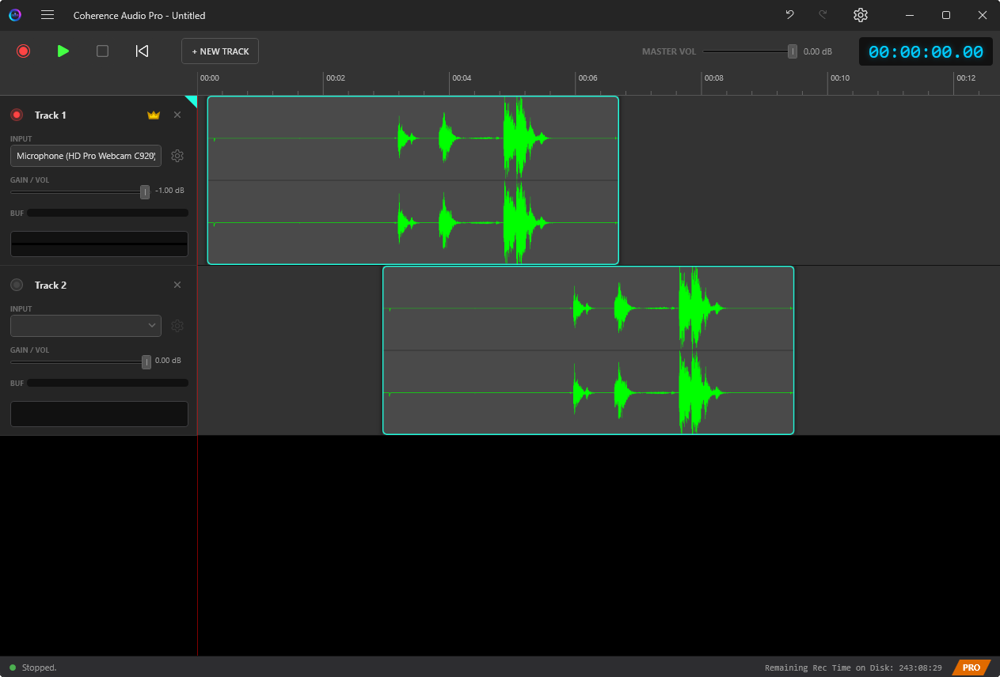

# Editing

This chapter covers Coherence Audio's timeline editing tools: navigating the workspace, selecting and moving clips, precise positioning, copy and paste operations, the Z-order layer system, and undoing mistakes.

---

## The Timeline

The timeline is the main workspace on the right side of the Coherence Audio window. It displays all tracks as horizontal rows. Each recording take appears as a **clip** — a rectangular region on a track row that represents a contiguous block of audio.

### Timeline Navigation

| Action | How |
|--------|-----|
| **Scroll vertically** | Mouse wheel (no modifier) |
| **Scroll horizontally** | Shift + mouse wheel, or horizontal tilt wheel (on mice that have one), or drag the horizontal scrollbar at the bottom |
| **Zoom in / out** | Ctrl + mouse wheel over the timeline |
| **Move the playhead** | Click anywhere on the timeline ruler at the top |
| **Toggle play/pause** | `Space` |

The playhead (vertical line) indicates the current playback or edit position.

---

## Selecting Clips

Click a clip to select it. A selected clip is visually highlighted.

To select multiple clips, hold `Shift` and click additional clips, or hold `Ctrl` and click to toggle individual clips in or out of the selection.

---

## Moving Clips

To move a clip, click and drag it horizontally within its track. You can also drag it vertically to a different track row.

> **Tip:** Moving a clip to overlap with another clip does not delete either clip — Coherence Audio uses a Z-order (layer) system to manage overlapping clips. See [Overlapping Clips and the Z-Order System](#overlapping-clips-and-the-z-order-system) below.

---

## Adjusting Clip Boundaries (Resize)

To trim or extend a clip, hover the mouse near the **left or right edge** of the clip. The cursor changes to a horizontal resize arrow (↔). Then:

- **Drag the left edge** to move the clip's start point — the left edge and the internal source offset both advance together, so the clip remains anchored at its right edge and the waveform content visible in the clip shifts accordingly.
- **Drag the right edge** to move the clip's end point — only the right boundary changes; the left edge and source offset are unaffected.

Both left- and right-edge resizes are fully undoable with `Ctrl+Z`.

> **Note:** Resize is not available while recording or playback is in progress.

---

## The Fine-Move Dialog

For precise positioning — when you need to move a clip by an exact number of milliseconds rather than dragging by eye — use the **Fine-Move** dialog.

To open it:
1. Select the clip you want to reposition.
2. Right-click the clip and choose **Fine Move…**

The Fine-Move dialog lets you enter an exact offset in milliseconds (positive to move right/later, negative to move left/earlier). This is particularly useful for:

- Aligning a clip to a specific timecode position.
- Nudging a clip by a precise latency offset that you have measured.
- Repositioning a clip to correct a known timing error with sample-level accuracy.

---

## Copy, Cut, and Paste

Coherence Audio supports standard copy/paste operations for clips.

### Copy — `Ctrl+C`

Copies the selected clip(s) to the clipboard. The original clips remain in place.

### Cut — `Ctrl+X`

Removes the selected clip(s) from the timeline and places them on the clipboard.

### Paste — `Ctrl+V`

Places a copy of the clipboard contents at the current playhead position.

**Which track does Paste land on?**

- If you have clicked on a track's timeline area, that track becomes **focused** — indicated by a small accent triangle in the top-right corner of its channel strip header. Paste will land on the focused track.
- If no track is focused, paste falls back to the source track (the track the clip was copied from).

To direct a paste to a specific track, click anywhere on the desired track's waveform area first to give it focus, then press `Ctrl+V`. Alternatively, right-click on empty space in the desired track and choose **Paste here** from the context menu.

### Paste-Insert — `Ctrl+Shift+V`

Paste-Insert works like Paste, but instead of simply placing the clip at the playhead position (potentially overlapping existing clips), it **inserts** the clip and pushes all subsequent clips on the track further right to make room.

Use Paste-Insert when you need to splice new content into the middle of a track without overlapping or overwriting what is already there.

---

## Overlapping Clips and the Z-Order System

### What Is Z-Order?

On any track, multiple clips can occupy the same time range — they form a **stack** of layers at that position. Each clip has a Z-order position that determines which clip is "on top." The topmost clip is visible and active during playback and export.

This is different from how many DAWs work. Rather than deleting or splitting the underlying clip when you place a new clip on top, Coherence Audio preserves all clips and lets you control which one wins.

### The Red Squiggly Overlap Indicator

When two or more clips on the same track overlap in time, a **red squiggly underline** appears on the lower-priority clips in the overlapping region.

The red squiggly is a deliberate, visible warning — it ensures you are always aware of hidden audio that is being masked by the topmost clip. Unexpected overlaps are a common source of confusion in timeline editing, and the indicator makes them immediately obvious.

### Clicking the Red Squiggly — Disambiguation Menu

When you **left-click on the red squiggly** overlap area, Coherence Audio opens a **layer disambiguation menu**. The menu lists all clips stacked at that position, from top layer to bottom, each with its time range. Click any entry to select that clip.

After making a plain single-clip selection from the disambiguation menu (no modifier key), Coherence Audio automatically opens the **clip context menu** for the selected clip — but only when exactly one clip is selected as a result. If the clip belongs to a group that expands to multiple clips, no context menu follows.

Modifier keys work the same as direct clip clicks:
- **Shift+click** an entry to add it to the current selection (no context menu follows).
- **Ctrl+click** an entry to toggle it (no context menu follows).

Hovering over the squiggly area also shows a tooltip — "N layers stacked here — click to select a specific layer."

### How to Resolve Overlaps

You have several options when you see the red squiggly:

1. **Move one of the clips** so they no longer overlap.
2. **Delete the lower clip** if you no longer need it.
3. **Reorder the Z-stack** so that the clip you want to hear is on top — right-click the overlap area and use **Bring to Front** (`Ctrl+]`), **Bring Forward** (`]`), **Send Backward** (`[`), or **Send to Back** (`Ctrl+[`).
4. **Leave it as-is** if the overlap is intentional and the topmost clip is the one you want.

### Select All Layers

When you right-click a clip in an area where multiple clips overlap, the context menu shows a **"Select All _N_ Layers"** item at the top. Clicking it selects all clips at that position simultaneously, which is useful when you want to move or delete the entire stack at once.

---

## Undo and Redo

All editing operations in Coherence Audio are fully undoable.

| Shortcut | Action |
|----------|--------|
| `Ctrl+Z` | Undo the last operation |
| `Ctrl+Y` | Redo (reapply an undone operation) |

The undo history covers:

- Clip moves and resizes
- Clip copies and pastes
- Clip cuts and deletions
- Fine-move adjustments
- Z-order changes
- Post-recording latency compensation and drift correction

> **Note:** Recording itself is not undoable in the traditional sense — once audio has been captured, it cannot be "unrecorded." However, you can delete clips from the timeline if a take is unwanted.

---

## Editing Workflow Tips

### Apply Post-Recording Steps Before Editing

After a recording stops, Coherence Audio automatically applies latency compensation and (if Pro) drift correction. These appear as separate entries on the undo stack. Before moving any clips manually, confirm that these automatic adjustments look correct. If not, undo them first.

### Labeling Tracks

Rename tracks to meaningful names (person's name, instrument, microphone position) before starting edits. Click the track name in the channel strip header and type a new name.

### Saving Before Editing

Save the project (`Ctrl+S` / `Ctrl+Shift+S`) before beginning significant edits. This gives you a saved snapshot to fall back to even if the undo history is lost (e.g., after reopening the project).
